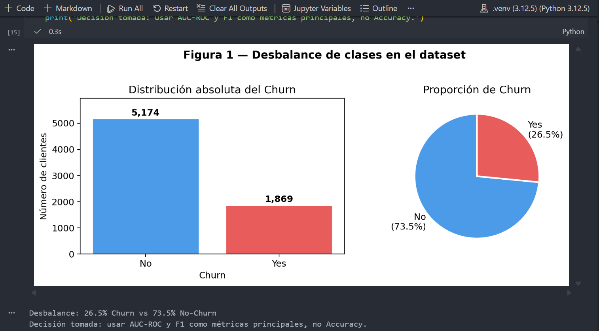
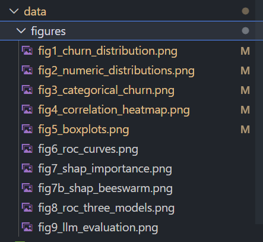
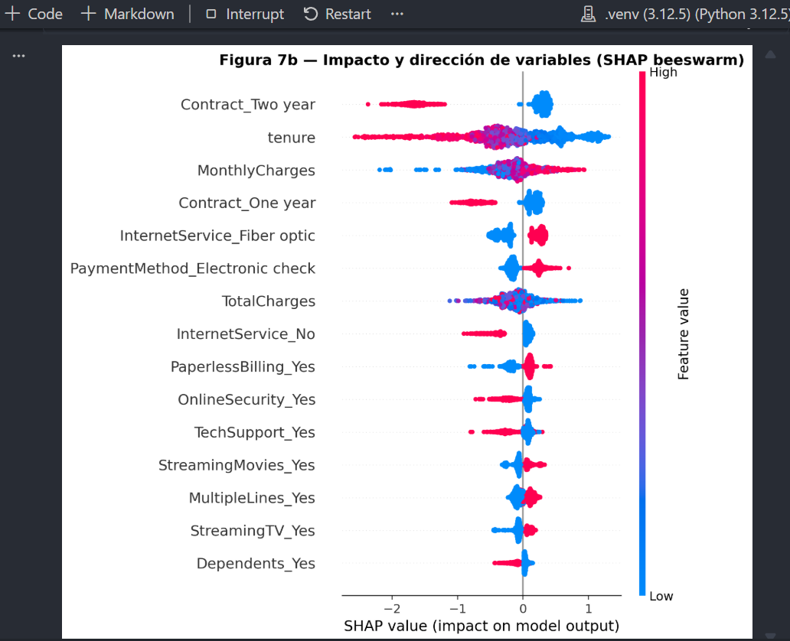
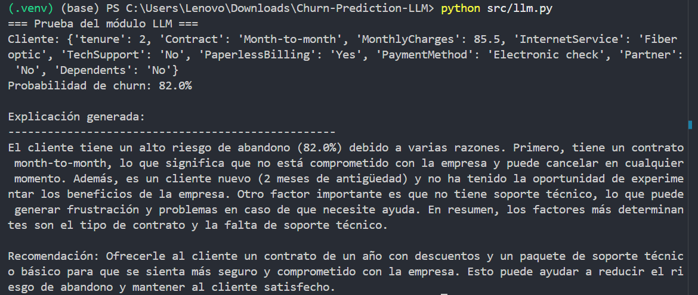
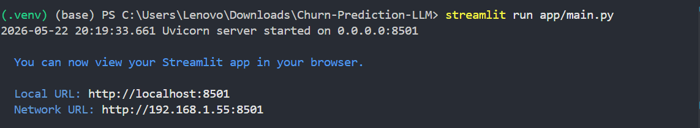
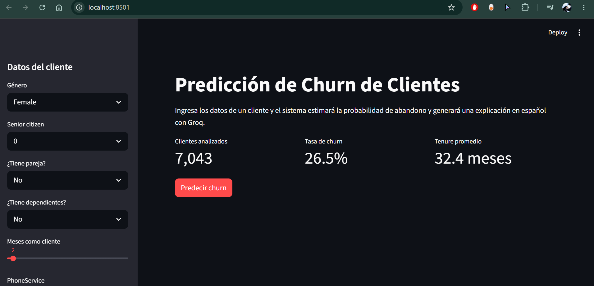
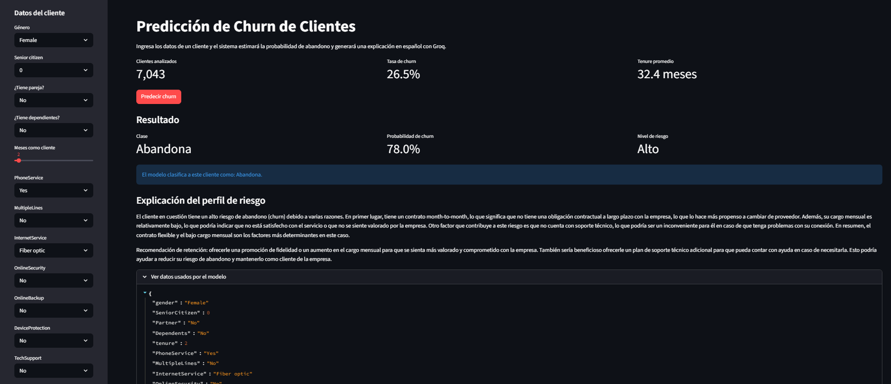
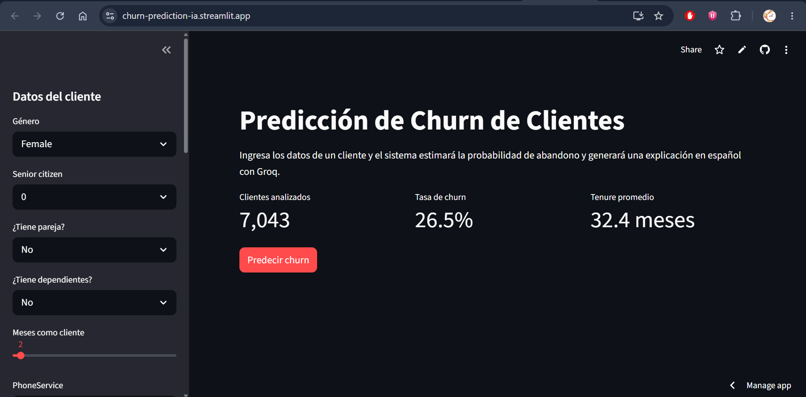
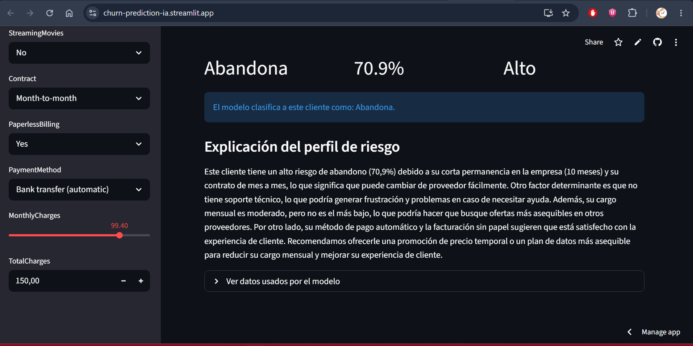

# Guía de usuario

## 1. Objetivo

Esta guía explica cómo instalar, ejecutar y comprobar el sistema de predicción de churn del proyecto **Churn-Prediction-LLM**. También indica qué pantallas conviene capturar para entregar una evidencia clara del funcionamiento.

## 2. Requisitos previos

Antes de iniciar, asegúrate de tener:

- Python 3.13 instalado.
- El repositorio descargado en tu equipo.
- Visual Studio Code o una terminal de PowerShell.
- Una API key válida de Groq para generar la explicación automática en español.

## 3. Instalación

### 3.1 Activar el entorno virtual

En Windows, abre PowerShell en la raíz del proyecto y ejecuta:

```powershell
Set-ExecutionPolicy -Scope Process -ExecutionPolicy RemoteSigned
.\.venv\Scripts\Activate.ps1
```

Si no tienes creado el entorno virtual, créalo primero con `python -m venv .venv` y luego actívalo.

### 3.2 Instalar dependencias

Con el entorno activado, instala los paquetes requeridos:

```powershell
pip install -r requirements.txt
```

Este archivo concentra las dependencias del proyecto para que cualquier persona pueda recrear el entorno con el mismo comando.

### 3.3 Configurar la API de Groq

Crea un archivo `.env` en la raíz del proyecto con este contenido:

```env
GROQ_API_KEY=tu_api_key
```

Si todavía no tienes una clave, puedes obtenerla en la consola de Groq.

### 3.4 Seleccionar el kernel de Jupyter

En VS Code, abre los notebooks y selecciona el kernel del mismo entorno virtual donde instalaste `requirements.txt`. Si es la primera vez que lo usas, registra el kernel con:

```powershell
python -m ipykernel install --user --name python313 --display-name "Python 3.13"
```

Si aparece un error como `ModuleNotFoundError`, casi siempre significa que el notebook está usando otro kernel distinto al entorno donde hiciste la instalación.

## 4. Orden de ejecución

El proyecto debe ejecutarse en este orden:

1. `notebooks/01_eda.ipynb`
2. `notebooks/02_modeling.ipynb`
3. `src/llm.py`
4. `app/main.py`

## 5. Cómo ejecutar cada parte

### 5.1 Análisis exploratorio

Abre `notebooks/01_eda.ipynb` y ejecuta todas las celdas en orden.

Resultado esperado:

- Se genera `data/telco_clean.csv`.
- Se crean las figuras del análisis en `data/figures/`.
- Se observan gráficos del dataset, variables clave y distribución del churn.






### 5.2 Entrenamiento del modelo

Abre `notebooks/02_modeling.ipynb` y ejecuta todas las celdas.

Resultado esperado:

- Se entrenan y comparan los modelos.
- Se generan métricas como AUC-ROC y F1.
- Se guarda el modelo final en `models/`.
- Se genera la explicación visual con SHAP.



### 5.3 Prueba del módulo LLM

En la terminal, ejecuta:

```powershell
python src/llm.py
```

Resultado esperado:

- Se imprime un cliente de ejemplo.
- Se muestra la probabilidad de churn.
- Se genera una explicación en español usando Groq.



### 5.4 Ejecutar la interfaz web

En la terminal, ejecuta:

```powershell
streamlit run app/main.py
```

Resultado esperado:

- Se abre la aplicación en el navegador.
- Puedes completar los datos del cliente desde la barra lateral.
- Al pulsar **Predecir churn**, se muestra la clase predicha, la probabilidad y la explicación automática.



ANTES


DESPUES


### 5.5 Demo interactiva desplegada

El proyecto fue publicado en Streamlit Cloud:

https://churn-prediction-ia.streamlit.app/






## 7. Validación rápida

Si todo está bien configurado, deberías poder confirmar lo siguiente:

- El archivo `data/telco_clean.csv` existe.
- La carpeta `models/` contiene el modelo entrenado.
- `python src/llm.py` devuelve un texto en español.
- `streamlit run app/main.py` abre la interfaz sin errores.

## 8. Observación final

Los notebooks deben ejecutarse en orden. Si cambias los datos o vuelves a entrenar el modelo, vuelve a correr primero el EDA y luego el modelado antes de abrir la app.
